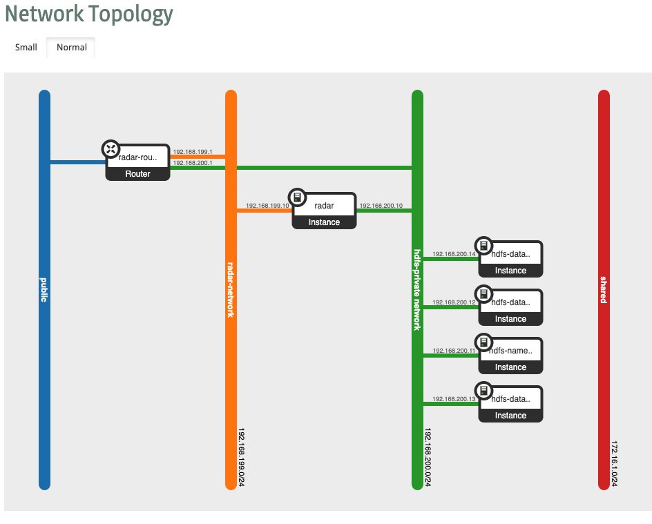

Deployment and Orchestration of the RADAR-base platform using Terraform

# Configurations
The Following Configurations to deploy are provided -

## Distributed HDFS (`distributed-setup/hdfs/`)
This configuration is provided with a distributed HDFS setup. 3 instances for datanodes and 1 instance for namenode.
And 1 large instance for all other RADAR components. The provided configuration is for resources on OpenStack but can be easily reciprocated for AWS and GCP.

The network topology is shown below -



Instance sizes can be easily changed by changing the respective instance resource blocks in `hdfs-vms.tf`.

### Usage

1. Set the OpenStack credentials and Auth details in the file `radar-openstack-terraform.tf`
    ```
    provider "openstack" {
      user_name   = "your-user-name"
      tenant_name = "your-tenancy"
      password    = "you-password"
      auth_url    = "http://localhost:10000/v3"
      region      = "regionOne"
      project_domain_id  = "default"
    }
    ```
2. Set the variables in `env.tfvars` according to your needs. Remember the `TERRAFORM_OPENSTACK_RADAR_STATIC_IP` should be on the `TERRAFORM_OPENSTACK_RADAR_SUBNET` and the `TERRAFORM_OPENSTACK_HDFS_*_STATIC_IP` should be on the `TERRAFORM_OPENSTACK_HDFS_SUBNET`

3. Set the variable in .env file for configuration of HDFS docker containers

4. Follow the Configuration option for other RADAR components as mentioned in `distributed-setup/hdfs/radar-cp-stack/README.md`

5. Initialise terraform in the directory
    ```sh
      cd distributed-setup/hdfs
      terraform init
    ```
6. Run terraform plan to dry run your setup
    ```sh
      terraform plan -var-file="env.tfvars" -out=tf.plan
    ```
7. Apply the terraform plan
    ```sh
      terraform apply "tf.plan"
    ```

### Optional

`Remote state management` is supported using Amazon S3 Backend with `State locking` using Amazon DynamoDB. By default, the state is only maintained locally.
To enable it, copy the file `remote-state.tf.template` to `remote-state.tf` and follow these steps -

1. Create an S3 Bucket. Head over to the S3 console, click the blue “Create Bucket” button, enter a name for the bucket.

2. Create an IAM user and give them access to S3 bucket. Generate the security credentials for the user.

3. Copy the `aws-secret.tfvars.template` to `aws-secret.tfvars` and enter the credentials obtained from step 2.

4. Run terraform init using the config file for backend as follows -
    ```sh
    terraform init \
      -backend-config="aws-secret.tfvars"
    ```

5. If want to use `State locking` using DynamoDB, then

    5.1 Add dynamodb permissions to your IAM user.

    5.2 Create a table with primary key `LockID`

    5.3 Configure the table name in `aws-secret.tfvars` as
        ```
          dynamodb_table = "<your-table-name>"
        ```
